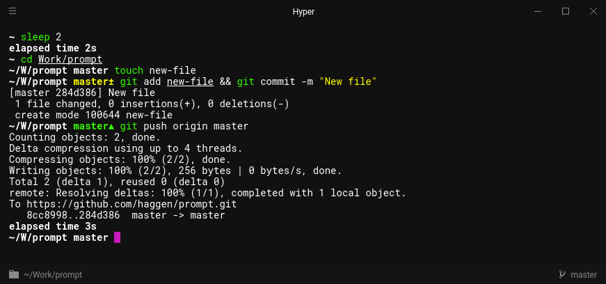

---

This is my custom zsh prompt.

- No framework dependency (oh-my-zsh, prezto, etc).
- Minimalistic but fast and a small profile.
- Displays elapsed time after command execution.
- If you're within a Git repository, it:
    - Displays the active branch.
    - Appends a cue when there's untracked files or unstaged changes, is is the middle of a rebase, or is ahead or behind remote.
